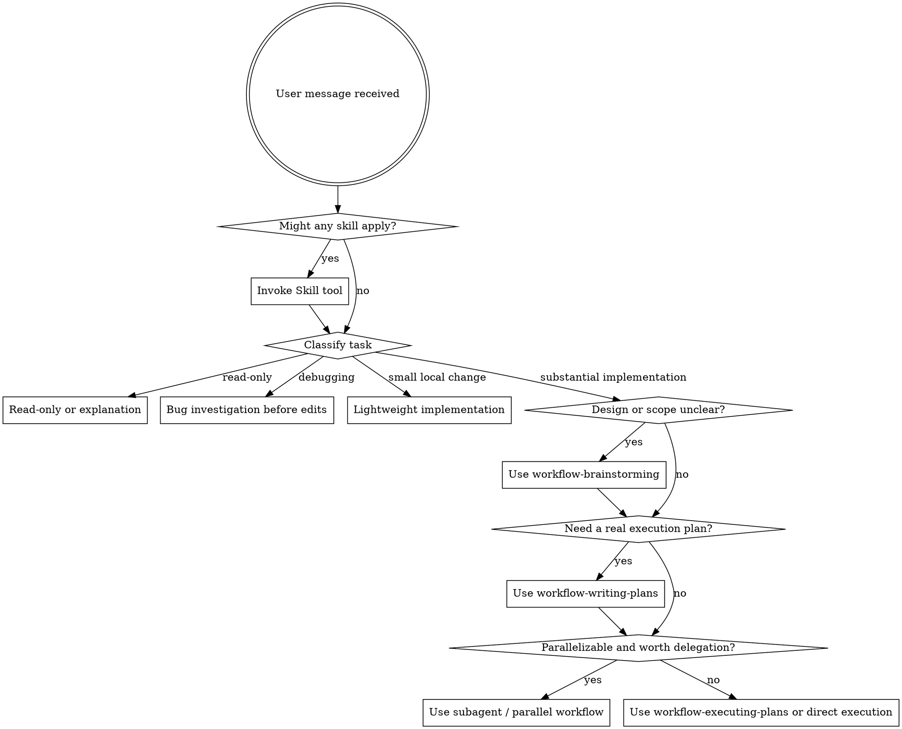

<SUBAGENT-STOP>
If you were dispatched as a subagent to execute a specific task, skip this skill.
</SUBAGENT-STOP>

<EXTREMELY-IMPORTANT>
If a skill clearly applies to the task, invoke it before acting. Do not skip relevant workflow skills because a task feels small or familiar.
</EXTREMELY-IMPORTANT>

## Instruction Priority

Workflow skills override default system prompt behavior, but **user instructions always take precedence**:

1. **User's explicit instructions** (CLAUDE.md, GEMINI.md, AGENTS.md, direct requests) — highest priority
2. **Workflow skills** — override default system behavior where they conflict
3. **Default system prompt** — lowest priority

If CLAUDE.md, GEMINI.md, or AGENTS.md says "don't use TDD" and a skill says "always use TDD," follow the user's instructions. The user is in control.

## How to Access Skills

**In Claude Code:** Use the `Skill` tool. When you invoke a skill, its content is loaded and presented to you—follow it directly. Never use the Read tool on skill files.

**In Gemini CLI:** Skills activate via the `activate_skill` tool. Gemini loads skill metadata at session start and activates the full content on demand.

**In other environments:** Check your platform's documentation for how skills are loaded.

## Platform Adaptation

Skills use Claude Code tool names. Non-CC platforms: see `references/codex-tools.md` (Codex) for tool equivalents. Gemini CLI users get the tool mapping loaded automatically via GEMINI.md.

# Using Skills

Read `references/task-routing.md` before choosing a heavy workflow. It defines the default lightweight path, escalation rules, and when parallelism is actually worth it.

## The Rule

**Invoke relevant or requested skills BEFORE substantial action.** Start by classifying the task, then choose the lightest workflow that still protects quality.

## Routing Rules

### Read-only tasks

Handle directly when the task is analysis, explanation, review without edits, or code reading.

### Bug investigation

Use `workflow-systematic-debugging` before proposing fixes when diagnosing a real failure and implementation has not begun yet.

### Lightweight implementation

Default to direct implementation with a minimal mental or written plan when the task is local and verification is direct. Do not force brainstorming, standalone specs, standalone plan files, worktrees, or subagents onto routine changes.

### Medium or large implementation

Use heavier workflows only when they add real value:

- `workflow-brainstorming` for unclear requirements, important trade-offs, or larger design work
- `workflow-writing-plans` when sequencing, coordination, or handoff needs a real plan
- `workflow-executing-plans` for complex but mostly sequential work
- `workflow-subagent-driven-development` or `workflow-dispatching-parallel-agents` when tasks are genuinely independent and parallelism is useful
- `workflow-using-git-worktrees` when isolation materially reduces risk

### Before completion

Always use `workflow-verification-before-completion` before claiming success, completion, or passing status.

## Red Flags

These thoughts mean STOP and re-triage:

| Thought                                      | Reality                                                       |
| -------------------------------------------- | ------------------------------------------------------------- |
| "This is just a simple question"             | Decide whether it is read-only, debugging, or implementation. |
| "I need a full workflow for safety"          | Use the lightest path that still covers the risk.             |
| "Let me skip the relevant skill"             | If a skill fits, use it.                                      |
| "I remember this skill"                      | Skills evolve. Read current version.                          |
| "Everything should go through brainstorming" | Lightweight changes usually should not.                       |
| "Everything should use subagents"            | Parallelism only helps when tasks are independent.            |
| "Let's create docs just in case"             | Persist docs only when they help execution or handoff.        |

## Skill Priority

When multiple skills could apply, use this order:

1. **Routing / process skills first** (debugging, brainstorming, planning) - these choose the path
2. **Execution skills second** (executing-plans, subagent workflows, implementation-domain skills)
3. **Verification / review skills last** - these confirm the result before completion

Examples:

- "Explain this module" → direct read-only work
- "Fix this failing test, not sure why" → workflow-systematic-debugging first
- "Update copy in one component" → lightweight implementation
- "Design and build a multi-file feature" → workflow-brainstorming, then workflow-writing-plans if needed
- "Execute this clear plan in one session" → workflow-executing-plans
- "Several independent tasks" → subagent or parallel workflow if support is reliable

## Skill Types

**Rigid** (TDD, debugging): Follow exactly. Don't adapt away discipline.

**Flexible** (patterns): Adapt principles to context.

The skill itself tells you which.

## User Instructions

Instructions say WHAT, not HOW. "Add X" or "Fix Y" doesn't mean skip workflows, but it also does not force the heaviest workflow when a lighter one is sufficient.
