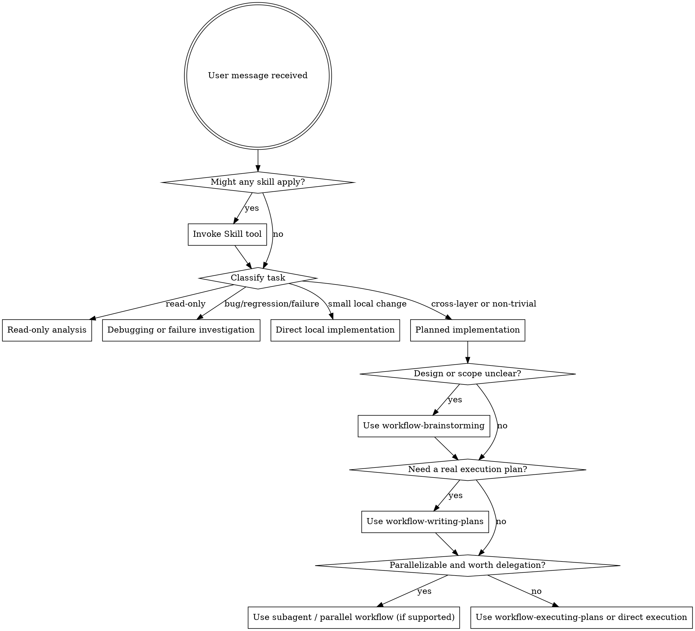

<SUBAGENT-STOP>
If you were dispatched as a subagent to execute a specific task, skip this skill.
</SUBAGENT-STOP>

<EXTREMELY-IMPORTANT>
If a skill clearly applies to the task, invoke it before acting. Do not skip relevant workflow skills because a task feels small or familiar.
</EXTREMELY-IMPORTANT>

## Instruction Priority

Workflow skills override default system prompt behavior, but **user instructions always take precedence**:

1. **User's explicit instructions** (CLAUDE.md, GEMINI.md, AGENTS.md, direct requests) — highest priority
2. **Workflow skills** — override default system behavior where they conflict
3. **Default system prompt** — lowest priority

If CLAUDE.md, GEMINI.md, or AGENTS.md says "don't use TDD" and a skill says "always use TDD," follow the user's instructions. The user is in control.

## How to Access Skills

**In Claude Code:** Use the `Skill` tool. When you invoke a skill, its content is loaded and presented to you—follow it directly. Never use the Read tool on skill files.

**In Gemini CLI:** Skills activate via the `activate_skill` tool. Gemini loads skill metadata at session start and activates the full content on demand.

**In other environments:** Check your platform's documentation for how skills are loaded.

## Platform Adaptation

Skills use Claude Code tool names. Non-CC platforms: see `references/codex-tools.md` (Codex) for tool equivalents. Gemini CLI users get the tool mapping loaded automatically via GEMINI.md.

If the current environment does not support subagents or reliable parallel execution, route to the equivalent sequential workflow in the current session instead of forcing delegation.

# Using Skills

Read `references/task-routing.md` before choosing a heavy workflow. It defines the default lightweight path, escalation rules, and when parallelism is actually worth it.

## The Rule

**Invoke relevant or requested skills BEFORE substantial action.** Start by classifying the task, then choose the lightest workflow that still protects quality.

## Routing Rules

Use `references/task-routing.md` as the routing source of truth. Reuse its task classes and shared routing signals rather than inventing a fresh taxonomy in the moment.

### Project spec context

If the target repo contains `docs/workflow/spec/`, use `workflow-project-spec` before substantial planning or implementation:

- initialize it when the user wants project-spec support but the directory does not exist yet
- load relevant spec files before writing plans or code
- update relevant spec files after reusable conventions or contracts are discovered

If code has already changed in a repo with `docs/workflow/spec/`, use `workflow-project-check` before completion claims, branch handoff, or review requests:

- classify the change scope
- identify the relevant spec files and verification commands
- decide whether cross-layer checks or spec updates are required

### Read-only tasks

Handle directly when the task is analysis, explanation, review without edits, or code reading.

### Debugging or failure investigation

Use `workflow-systematic-debugging` before proposing fixes when diagnosing a real failure and implementation has not begun yet.

### Direct local implementation

Default to direct implementation with a minimal mental or written plan when the task is local and verification is direct. If the task changes behavior and a failing automated check is practical, prefer `workflow-test-driven-development` rather than making ad hoc edits first. Do not force brainstorming, standalone specs, standalone plan files, worktrees, or subagents onto routine changes.

If the task is explicitly non-behavioral cleanup, readability refactoring, or recently touched code simplification, invoke `workflow-code-simplifier` as the implementation skill instead of improvising cleanup rules.

### Planned implementation

Use heavier workflows only when they add real value:

- `workflow-brainstorming` for unclear requirements, important trade-offs, or larger design work
- `workflow-writing-plans` when sequencing, coordination, or handoff needs a real plan
- `workflow-executing-plans` for complex but mostly sequential work
- `workflow-project-spec` whenever repo-specific implementation context should be initialized, loaded, or refreshed from `docs/workflow/spec/`
- `workflow-subagent-driven-development` or `workflow-dispatching-parallel-agents` when tasks are genuinely independent, parallelism is useful, and the environment supports reliable delegation
- fall back to `workflow-executing-plans` when the task is independent in theory but the environment does not support subagents or parallel execution
- `workflow-using-git-worktrees` when isolation materially reduces risk

Treat contract, schema, config, and cross-layer signals as strong reasons to enter this path even if the raw file count still looks small.

### Shared Routing Signals

When file paths, diff context, or repo-aware signals are available, reuse the same dimensions exposed later by `workflow-project-check`:

- `docs_only` and `test_only` usually stay light
- `cross_layer`, `contract_change`, `schema_change`, and most `config_change` work should not stay on the lightest path
- `shared_code_change` means the blast radius may be larger than the diff size suggests

This keeps entry routing and final verification aligned around one vocabulary.

### Before completion

Always use `workflow-verification-before-completion` before claiming success, completion, or passing status.
When `docs/workflow/spec/` exists and code changed, use `workflow-project-check` before that final verification gate.

## Red Flags

These thoughts mean STOP and re-triage:

| Thought                                      | Reality                                                       |
| -------------------------------------------- | ------------------------------------------------------------- |
| "This is just a simple question"             | Decide whether it is read-only, debugging, or implementation. |
| "I need a full workflow for safety"          | Use the lightest path that still covers the risk.             |
| "Let me skip the relevant skill"             | If a skill fits, use it.                                      |
| "I remember this skill"                      | Skills evolve. Read current version.                          |
| "Everything should go through brainstorming" | Lightweight changes usually should not.                       |
| "Everything should use subagents"            | Parallelism only helps when tasks are independent.            |
| "Let's create docs just in case"             | Persist docs only when they help execution or handoff.        |

## Skill Priority

When multiple skills could apply, use this order:

1. **Routing / process skills first** (debugging, brainstorming, planning) - these choose the path
2. **Execution skills second** (executing-plans, subagent workflows, implementation-domain skills)
3. **Verification / review skills last** - these confirm the result before completion

Examples:

- "Explain this module" → direct read-only work
- "Fix this failing test, not sure why" → workflow-systematic-debugging first
- "Update copy in one component" → lightweight implementation
- "Simplify this recently changed module without changing behavior" → workflow-code-simplifier
- "Design and build a multi-file feature" → workflow-brainstorming, then workflow-writing-plans if needed
- "Execute this clear plan in one session" → workflow-executing-plans
- "Several independent tasks" → subagent or parallel workflow only if support is reliable; otherwise execute sequentially in the current session
- "Work is implemented and needs project-aware verification" → workflow-project-check, then workflow-verification-before-completion

## Skill Types

**Rigid** (TDD, debugging): Follow exactly. Don't adapt away discipline.

**Flexible** (patterns): Adapt principles to context.

The skill itself tells you which.

## User Instructions

Instructions say WHAT, not HOW. "Add X" or "Fix Y" doesn't mean skip workflows, but it also does not force the heaviest workflow when a lighter one is sufficient.
