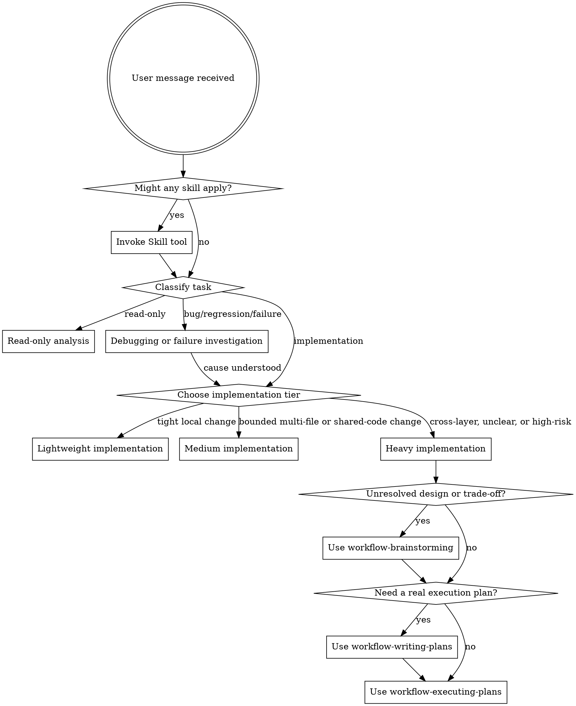

<SUBAGENT-STOP>
If you were dispatched as a subagent to execute a specific task, skip this skill.
</SUBAGENT-STOP>

<EXTREMELY-IMPORTANT>
If a skill clearly applies to the task, invoke it before acting. Do not skip relevant workflow skills because a task feels small or familiar.
</EXTREMELY-IMPORTANT>

## Instruction Priority

Workflow skills override default system prompt behavior, but **user instructions always take precedence**:

1. **User's explicit instructions** (CLAUDE.md, GEMINI.md, AGENTS.md, direct requests) — highest priority
2. **Workflow skills** — override default system behavior where they conflict
3. **Default system prompt** — lowest priority

If CLAUDE.md, GEMINI.md, or AGENTS.md says "don't use TDD" and a skill says "always use TDD," follow the user's instructions. The user is in control.

## How to Access Skills

**In Claude Code:** Use the `Skill` tool. When you invoke a skill, its content is loaded and presented to you—follow it directly. Never use the Read tool on skill files.

**In Gemini CLI:** Skills activate via the `activate_skill` tool. Gemini loads skill metadata at session start and activates the full content on demand.

**In other environments:** Check your platform's documentation for how skills are loaded.

## Platform Adaptation

Skills use Claude Code tool names. Non-CC platforms: see `references/codex-tools.md` (Codex) for tool equivalents. Gemini CLI users get the tool mapping loaded automatically via GEMINI.md.

If the current environment does not support subagents or reliable parallel execution, route to the equivalent sequential workflow in the current session instead of forcing delegation.

# Using Skills

Read `references/task-routing.md` before choosing an implementation tier. It defines the route families, the `lightweight` / `medium` / `heavy` implementation split, and the escalation rules.

## The Rule

**Invoke relevant or requested skills BEFORE substantial action.** Start by classifying the task type, then choose the lightest implementation tier that still covers current uncertainty, blast radius, and verification risk. If `medium` vs `heavy` is unclear, start with `heavy` and de-escalate later when evidence supports it.

## Routing Rules

Use `references/task-routing.md` as the routing source of truth. Reuse its route families, implementation tiers, and shared routing signals rather than inventing a fresh taxonomy in the moment.

### Risk-first tie-breaker

When a task plausibly fits both `medium implementation` and `heavy implementation`, default to `heavy implementation` first. De-escalate only after boundaries, dependencies, and verification checkpoints become explicit enough for a bounded checklist.

## User-visible routing

After you choose the route, tell the user which route you are taking and why before substantial work begins.

- Name the route explicitly, such as `read-only analysis`, `debugging or failure investigation`, `lightweight implementation`, `medium implementation`, or `heavy implementation`.
- Give the concrete reason using the task signals that triggered the route, not generic filler.
- Phrase the announcement using the active language policy for the current session.
- Keep the announcement brief, but do not keep the routing decision implicit.
- If the route changes later because the scope expands or risk drops, tell the user that the route changed and why.

### Project spec context

If the target repo contains `docs/workflow/spec/`, use `workflow-project-spec` before substantial planning or implementation:

- initialize it when the user wants project-spec support but the directory does not exist yet
- load relevant spec files before writing plans or code
- update relevant spec files after reusable conventions or contracts are discovered

If code has already changed in a repo with `docs/workflow/spec/`, use `workflow-project-check` before completion claims, branch handoff, or review requests:

- classify the change scope
- identify the relevant spec files and verification commands
- decide whether cross-layer checks or spec updates are required

### Read-only tasks

Handle directly when the task is analysis, explanation, review without edits, or code reading.

### Debugging or failure investigation

Use `workflow-systematic-debugging` before proposing fixes when diagnosing a real failure and implementation has not begun yet.

### Lightweight implementation

Default to direct implementation with a minimal inline note when the task is local and verification is direct. If the task changes behavior and a failing automated check is practical, prefer `workflow-test-driven-development` rather than making ad hoc edits first. Do not force brainstorming, standalone specs, standalone plan files, worktrees, or heavyweight orchestration onto routine changes.

If the task is explicitly non-behavioral cleanup, readability refactoring, or recently touched code simplification, invoke `workflow-code-simplifier` as the implementation skill instead of improvising cleanup rules.

### Medium implementation

Use a medium route when the work is more than a tight local fix but still bounded enough that a short explicit checklist is sufficient:

- shared code changes with understandable blast radius
- multiple related files in one subsystem slice
- bounded contract or config continuity concerns
- verification that needs several focused checks instead of one obvious command
- impacted boundaries and verification checkpoints that are clear before coding

Default to a short inline plan or checklist, then execute sequentially checkpoint by checkpoint in the current session. If the checklist stops being sufficient, upgrade to `workflow-writing-plans`. Do not skip this middle route by forcing the task into either ad hoc local execution or the heaviest planning flow.

`medium implementation` is for bounded execution, not for discovery. If you cannot state impacted boundaries, likely callers, and verification checkpoints before coding, escalate to `heavy implementation` and use `workflow-brainstorming`.

### Heavy implementation

Use `heavy implementation` when uncertainty or cross-layer risk can invalidate a short checklist:

- `workflow-brainstorming` by default when heavy work still has unresolved boundaries, migration or rollout choices, or more than one viable design option
- `workflow-writing-plans` when sequencing, coordination, or handoff needs a real plan
- `workflow-executing-plans` for complex but mostly sequential work
- `workflow-project-spec` whenever repo-specific implementation context should be initialized, loaded, or refreshed from `docs/workflow/spec/`
- optional parallel workflows only when tasks are genuinely independent and the environment supports that mode reliably
- fall back to `workflow-executing-plans` when the task is independent in theory but parallel execution is not worth the coordination cost
- `workflow-using-git-worktrees` when isolation materially reduces risk

Treat contract, schema, config, migration, and cross-layer signals as strong reasons to enter this path even if the raw file count still looks small.

### Shared Routing Signals

When file paths, diff context, or repo-aware signals are available, reuse the same dimensions exposed later by `workflow-project-check`:

- `docs_only` and `test_only` usually stay light
- `shared_code_change` means the blast radius may be larger than the diff size suggests, so it should usually be at least medium
- `cross_layer` is usually heavy; keep it at medium only when boundaries are explicit, caller impact is known, and rollout risk is low
- `contract_change` should usually be at least medium, and is heavy when the contract is widely shared, caller impact is uncertain, or compatibility strategy is required
- `schema_change` is usually heavy
- most `config_change` work should be at least medium, and heavy when rollout or environment coordination matters
- if two or more medium-or-higher signals appear together, classify as `heavy implementation` at entry and de-escalate only after uncertainty is removed

This keeps entry routing and final verification aligned around one vocabulary.

### Before completion

Always use `workflow-verification-before-completion` before claiming success, completion, or passing status.
When `docs/workflow/spec/` exists and code changed, use `workflow-project-check` before that final verification gate.

## Red Flags

These thoughts mean STOP and re-triage:

| Thought                                      | Reality                                                       |
| -------------------------------------------- | ------------------------------------------------------------- |
| "This is just a simple question"             | Decide whether it is read-only, debugging, or implementation. |
| "I need a full workflow for safety"          | Use the lightest path that still covers the risk.             |
| "Everything is either local or heavy"        | Medium implementation exists for bounded but non-trivial work. |
| "Let me skip the relevant skill"             | If a skill fits, use it.                                      |
| "I remember this skill"                      | Skills evolve. Read current version.                          |
| "Everything should go through brainstorming" | Lightweight changes usually should not.                       |
| "I can keep this medium until coding reveals risk" | Route based on known risk signals before coding, not after surprises. |
| "I already have one idea, so brainstorming is unnecessary" | Heavy work with unresolved trade-offs still needs explicit option review. |
| "Everything should use subagents"            | Parallelism only helps when tasks are independent.            |
| "Let's create docs just in case"             | Persist docs only when they help execution or handoff.        |

## Skill Priority

When multiple skills could apply, use this order:

1. **Routing / process skills first** (debugging, brainstorming, planning) - these choose the path
2. **Execution skills second** (executing-plans, implementation-domain skills, optional parallel workflows)
3. **Verification / review skills last** - these confirm the result before completion

Examples:

- "Explain this module" → direct read-only work
- "Fix this failing test, not sure why" → workflow-systematic-debugging first
- "Update copy in one component" → lightweight implementation
- "Adjust shared validation used by two callers" → medium implementation
- "Simplify this recently changed module without changing behavior" → workflow-code-simplifier
- "Design and build a cross-layer feature with migration or rollout risk" → heavy implementation, workflow-brainstorming first, then workflow-writing-plans
- "Execute this clear plan in one session" → workflow-executing-plans
- "Several independent tasks" → subagent or parallel workflow only if support is reliable; otherwise execute sequentially in the current session
- "Work is implemented and needs project-aware verification" → workflow-project-check, then workflow-verification-before-completion

## Skill Types

**Rigid** (TDD, debugging): Follow exactly. Don't adapt away discipline.

**Flexible** (patterns): Adapt principles to context.

The skill itself tells you which.

## User Instructions

Instructions say WHAT, not HOW. "Add X" or "Fix Y" doesn't mean skip workflows, but it also does not force the heaviest workflow when `lightweight` or `medium` is sufficient.
